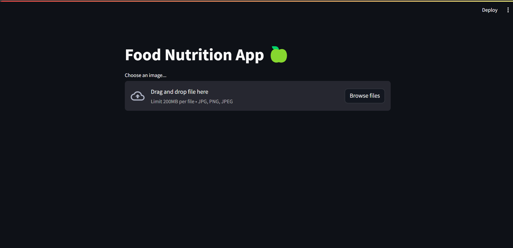
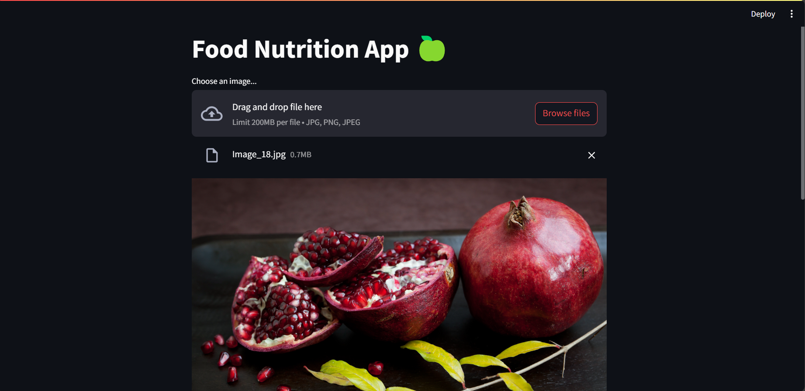
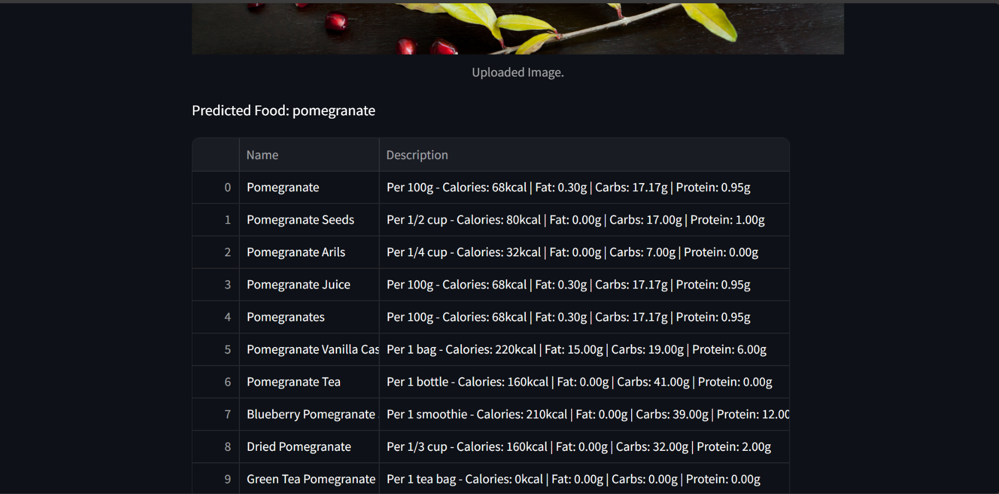
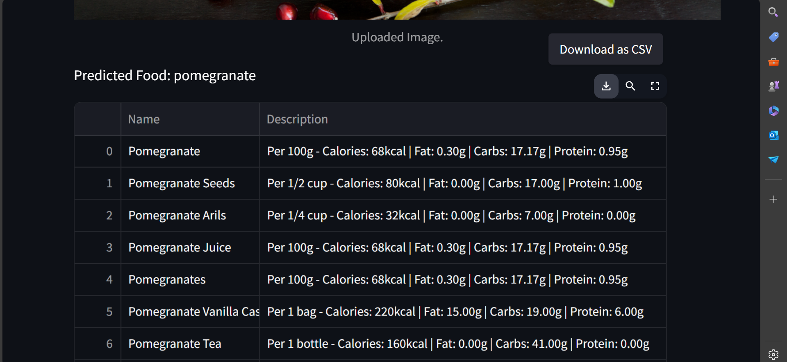

# Food Recognition System using MobileNet Model and FatSecret API in Streamlit Framework

## Overview

Welcome to the Food Recognition System! This project integrates computer vision and machine learning to identify food items from images uploaded by users. Leveraging the power of the MobileNet model for image classification and the FatSecret API for retrieving nutritional information, our system provides accurate food recognition and detailed nutritional data. Built with the user-friendly Streamlit framework, this project aims to empower users to make informed dietary choices and promote healthier eating habits.

## Features

- **Image Classification**: Uses the MobileNet model to classify food items from user-uploaded images.
- **Nutritional Information**: Retrieves detailed nutritional data from the FatSecret API.
- **User-Friendly Interface**: Built with Streamlit for an intuitive and seamless user experience.
- **Promotes Healthy Eating**: Helps users make informed dietary choices by providing comprehensive nutritional information.

## Installation

To run this project locally, follow these steps:

1. **Clone the repository**:
    ```bash
    git clone https://github.com/Paresht78/FoodRecognitionSystem.git
    cd FoodRecognitionSystem
    ```

2. **Create and activate a virtual environment**:
    ```bash
    python -m venv env
    source env/bin/activate   # On Windows use `env\Scripts\activate`
    ```

3. **Install the required packages**:
    ```bash
    pip install -r requirements.txt
    ```

4. **Set up your FatSecret API credentials**:
    - Create an account on the [FatSecret Developer](https://platform.fatsecret.com/) website.
    - Create a new application to obtain your API key and secret.
    - Set your credentials in the environment variables or directly in the script.

5. **Run the Streamlit application**:
    ```bash
    streamlit run StreamlitAppFatSecrateUse.py
    ```

## Usage

1. **Upload an Image**: Use the interface to upload an image of a food item.
2. **View Results**: The system will classify the food item and display the nutritional information retrieved from the FatSecret API.
3. **Make Informed Choices**: Use the provided nutritional data to make healthier dietary choices.

## Project Structure

- `app.py`: The main Streamlit application file.
- `model.py`: Contains the code for loading and using the MobileNet model.
- `fatsecret_api.py`: Handles interactions with the FatSecret API.
- `requirements.txt`: Lists all the dependencies required for the project.
- `README.md`: Project documentation.

## Acknowledgements

This project is made possible by the following:

- [MobileNet](https://builtin.com/machine-learning/mobilenet): A lightweight and efficient deep learning model for image classification.
- [FatSecret API](https://platform.fatsecret.com/): Provides comprehensive nutritional information.
- [Streamlit](https://streamlit.io/): An open-source app framework for Machine Learning and Data Science.

## Images






## Video

Watch the demo video below to see the Food Recognition System in action:

[Download Video](FoodNutritionApp.mp4)


## Contributing

We welcome contributions to this project! If you have any suggestions or improvements, feel free to open an issue or submit a pull request.

---

Thank you for using the Food Recognition System! We hope this tool helps you make healthier and more informed dietary choices. For any questions or feedback, please contact us at [pareshtilokani088@gmail.com].
